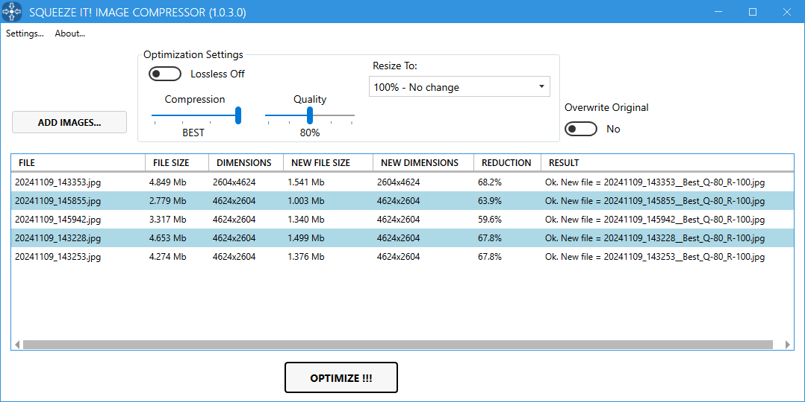

# Squeeze It!
**Squeeze It!** is a simple Windows application for an Image Compressor Tool based on Pingo.exe (https://css-ig.net/pingo).

DON'T USE ONLINE SERVICES TO OPTIMIZE YOUR IMAGES! No one knows what they'll do with the images you upload to them.

This simple app is capable of optimizing and reducing the dimensions of the image to compress it even more.

This application is made for Windows and requires .NET Framework 4.8. The project includes an installer that is built when the solution is in Release mode. The installer will install .NET Framework 4.8 if necessary.

